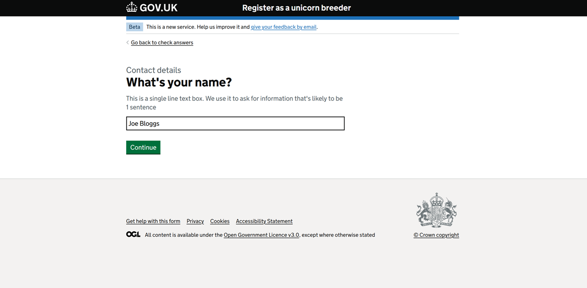

## Installation

[See our getting started developer guide](./getting-started).

## Demo

If you are within the Defra network, [see a live demo](https://forms-engine-plugin-example-ui.dev.cdp-int.defra.cloud/example-form).

If you aren't within the Defra network, [see our example UI and run it locally](https://github.com/DEFRA/forms-engine-plugin-example-ui).

## Screenshot

